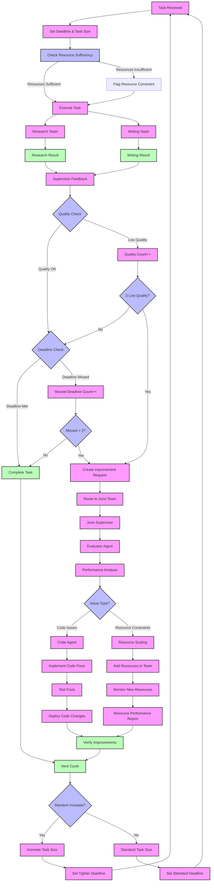

<!-- Copyright © 2025 PI & Other Tales Inc.. All Rights Reserved. -->
# Othertales Juno Workflow Diagram

The following Mermaid diagram illustrates the self-improving workflow for Othertales Juno, showing how the system evaluates its performance, identifies resource constraints, and deploys improved code and resources.

## Key Workflow Components

1. **Task Management**
   - Task received with deadline
   - Dynamic workload adjustments
   - Resource sufficiency checks

2. **Execution**
   - Research and writing teams process tasks
   - Supervisor evaluates outputs
   - Quality and deadline tracking

3. **Issue Identification**
   - Consecutive low quality triggers improvement
   - Missed deadlines trigger resource analysis
   - Performance metrics signal resource constraints

4. **Juno Team Response**
   - Evaluator analyzes performance data
   - Code agent implements fixes for quality issues
   - Resource scaling when deadlines missed
   
5. **Resource Management**
   - Add resources to constrained teams
   - Monitor performance of new resources
   - Adjust resource allocation based on metrics

6. **Cycle Restart**
   - Random workload increase (30% probability)
   - Task size can increase up to 2x
   - Deadlines adjusted based on task size